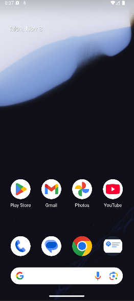
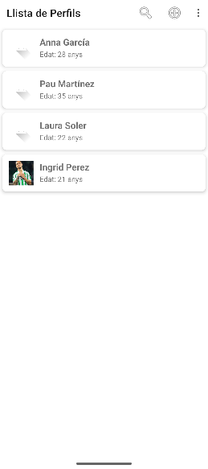
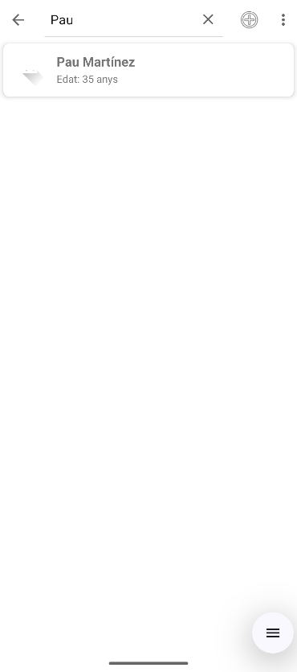
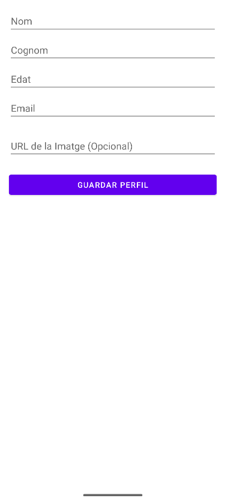
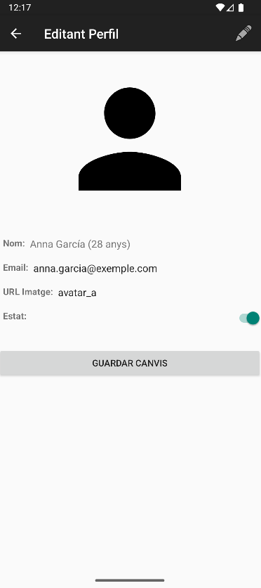
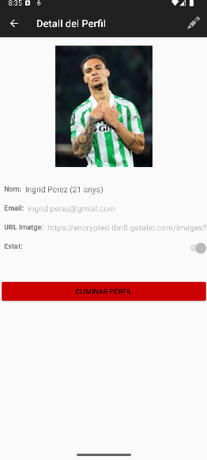
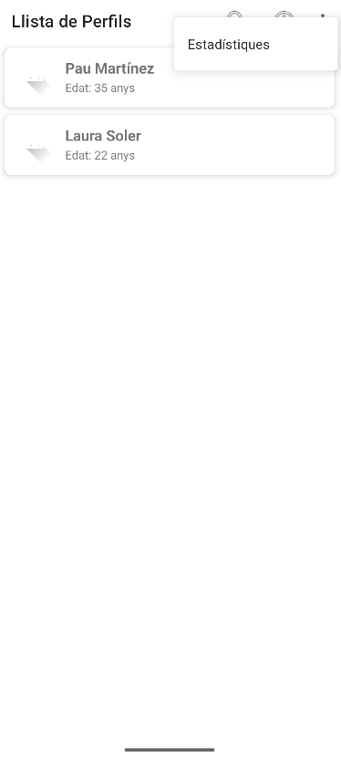

# 📱 Gestor de Perfils (Android Kotlin)

## ✨ Descripció del Projecte

Aquesta aplicació Android, desenvolupada íntegrament en **Kotlin**, és un gestor complet de perfils d'usuari. Permet la gestió persistent de dades, la creació, edició i eliminació de perfils, i ofereix funcionalitats avançades per a una experiència d'usuari (UX) òptima.

Les dades es persisteixen localment mitjançant fitxers **JSON** a l'emmagatzematge intern del dispositiu, assegurant que els canvis es mantinguin entre sessions.

---

## 🚀 Funcionalitats Principals

* **Llista de Perfils:** Visualització en llista amb `RecyclerView`.
* **Detall i Edició:** Pantalla per visualitzar i modificar els camps de cada perfil.
* **Persistència JSON:** Les dades es guarden i es carreguen utilitzant `Gson` per mantenir l'estat.
* **Assignació d'ID Única:** Generació automàtica d'ID per a cada nou perfil.
* **Cerca Dinàmica:** Filtració en temps real de la llista utilitzant `SearchView`.
* **Eliminació Segura:**
    * Eliminació amb confirmació des de la pantalla de detall.
    * ***Swipe-to-Delete*** amb confirmació per a una UX fluida.
* **Pantalla d'Estadístiques:** Mostra mètriques clau (total de perfils, actius/inactius i mitjana d'edat).
* **Manteniment de Dades:** Opció al menú principal per **Restaurar Dades** (reset) al seu estat inicial des del fitxer d'Assets.

---

## 🛠️ Tecnologies i Llibreries

* **Llenguatge de Programació:** Kotlin
* **Arquitectura:** Activities (Amb ús de `registerForActivityResult`)
* **Persistència:** JSON + Emmagatzematge Intern d'Android (`Internal Storage`)
* **Libreries:**
    * `Gson` per la serialització/deserialització JSON.
    * `AndroidX AppCompat` i `ConstraintLayout`.
    * `RecyclerView` i `ItemTouchHelper` per la llista i el *swipe-to-delete*.
    * `AlertDialog` per les confirmacions de seguretat.

---

## ⚙️ Estructura de Dades

El projecte utilitza el `data class` `PerfilUsuari` per a la gestió de la informació. La persistència es basa en el fitxer `dades_usuaris.json`.

```kotlin
data class PerfilUsuari(
    val id: Int,
    val nom: String,
    val cognom: String,
    val edat: Int,
    val email: String,
    val imatgeUrl: String,
    val actiu: Boolean
) : Parcelable
```

---

## 🖼️ Screenshots

En aquest apartat veurem les diferents pantalles de l'app, des de la pantalla d'inici fins a la d'estadístiques, per ordre.

La primera pantalla al iniciar el emulador mostra la **icona de l'app**.



La següent pantalla després de fer click sobre la icona de l'app ens porta a la **pantalla principal** on podem veure dos botons. 

Aquesta és la **"pantalla de loading"**:


i aquesta la **pantalla principal**:


El primer, ens porta a la pantalla del **llistat de perfils**. El segon és un botó de **"reset de valors"** per a tornar a carregar els valors del [arxiu de dades originals](app/src/main/assets/dades_usuaris.json)


La pantalla del **llistat de perfils** és la següent:



En aquesta pantalla podem veure diversos elements dins un mini toolbar amb les funcions de filtrar per nom, crear nous perfils i l'últim com a redireccionable a la **pantalla d'estadístiques**.

Aquí tenim un exemple de com filtrar un usuari:




Per a crear un nou perfil, farem click sobre el símbol de + a la part dreta de la toolbar i ens portarà a **la pantalla de crear perfil**.



Si en comptes de crear, volem accedir a les dades d'un perfil, només hem de **clicar sobre el perfil** que volem. Ens portarà a la **pantalla de detall de perfil**.

En cas de no tenir una imatge personalitzada, ens sortirà amb el avatar default:


Podem editar-lo fent clic sobre la icona del llapis:



Per desar els canvis realitzats, haurem de clicar al botó de **"Guardar Canvis"**.

En cas de tenir un perfil amb imatge, ens sortirà així:



Per eliminar un perfil podem fer-ho des de la pantalla de dades del propi usuari o fent ***swipe*** d'esquerra a dreta (o a l'inrevés) i confirmar:


Per últim, si volem veure les estadístiques de la app (total de perfils creats, % de perfils actius / inactius, mitjana d'edat...) farem click sobre els 3 punts a la cantonada de la pantalla principal:



Així es veu aquesta pantalla:


--- 

## 🔬 Tests d'Integració (UI)

El projecte inclou tests instrumentats basats en **Espresso** per garantir la correcció del flux d'usuari i les validacions de dades en les activitats clau.

Els tests se centren en dos fluxos essencials:

1. Validació de la Creació de Perfils (```NouPerfilActivity```)

Aquest test verifica que la lògica de validació de camps buits funciona correctament i que la creació exitosa finalitza l'activitat.

* **Test d'Èxit**: S'omplen tots els camps obligatoris i es comprova que l'Activity **es tanca** retornant un codi ```RESULT_OK```.

* **Test d'Error (Validació Fallida)**: Es deixa un camp obligatori buit (p. ex., el Nom). Es comprova que l'Activity **no es tanca** i que es mostra un ```AlertDialog``` amb el missatge d'error a l'usuari.

2. Validació de l'Eliminació Segura (```LlistaPerfilsActivity```)

Aquest test verifica el flux complet d'eliminació amb confirmació, que és crític per a la integritat de les dades.

* **Test d'Eliminació Real**: Es realitza el gest de swipe sobre un ítem, s'espera que aparegui el diàleg de confirmació ("Confirmar Eliminació") i es clica el botó **"Eliminar"**. Es verifica que l'element desapareix de la llista.

* **Test de Cancel·lació**: Es realitza el swipe i, al diàleg de confirmació, es clica **"Cancel·lar"**. Es verifica que l'ítem torna a la seva posició i es manté visible a la llista.

Aquests tests garanteixen que les dades són tractades amb seguretat i que la UX es comporta com s'espera sota diferents condicions.

---

## 👨‍🏫 Per a l'Avaluador (Resultats dels Tests unitaris)

Tots els tests unitaris i d'instrumentació requerits han estat executats amb èxit a l'emulador i han passat.

Els informes complets de la prova generats per Gradle (incloent-hi l'informe HTML) es troben a la carpeta comprimida app/build/reports/ al lliurament del projecte.

Per a comprovar-ho, es poden executar per ordre:

```bash
./gradlew testDebugUnitTest
```

i després:

```bash
./gradlew connectedDebugAndroidTest
```

Al ordinador personal, va sortir això:

``` 
PS C:\Users\marc.martin\AndroidStudioProjects\GestorPerfils> ./gradlew testDebugUnitTest

Welcome to Gradle 8.11.1!

Here are the highlights of this release:
 - Parallel load and store for Configuration Cache
 - Java compilation errors at the end of the build output
 - Consolidated report for warnings and deprecations

For more details see https://docs.gradle.org/8.11.1/release-notes.html

Starting a Gradle Daemon, 1 incompatible Daemon could not be reused, use --status for details

> Task :app:compileDebugKotlin
w: file:///C:/Users/marc.martin/AndroidStudioProjects/GestorPerfils/app/src/main/java/com/example/gestorperfils/PerfilUsuari.kt:8:1 Parcelize annotations from package 'kotlinx.android.parcel' are deprecated. Change package to 'kotlinx.parcelize'.
w: file:///C:/Users/marc.martin/AndroidStudioProjects/GestorPerfils/app/src/main/java/com/example/gestorperfils/PerfilsAdapter.kt:90:56 'fun String.toLowerCase(): String' is deprecated. Use lowercase() instead.
w: file:///C:/Users/marc.martin/AndroidStudioProjects/GestorPerfils/app/src/main/java/com/example/gestorperfils/PerfilsAdapter.kt:99:32 'fun String.toLowerCase(): String' is deprecated. Use lowercase() instead.
w: file:///C:/Users/marc.martin/AndroidStudioProjects/GestorPerfils/app/src/main/java/com/example/gestorperfils/PerfilsAdapter.kt:100:43 'fun String.toLowerCase(): String' is deprecated. Use lowercase() instead.

BUILD SUCCESSFUL in 1m 33s
22 actionable tasks: 10 executed, 12 up-to-date
PS C:\Users\marc.martin\AndroidStudioProjects\GestorPerfils> ./gradlew connectedDebugAndroidTest

> Task :app:connectedDebugAndroidTest
Starting 6 tests on Medium_Phone_API_36.0(AVD) - 16

Medium_Phone_API_36.0(AVD) - 16 Tests 1/6 completed. (0 skipped) (0 failed)
Medium_Phone_API_36.0(AVD) - 16 Tests 3/6 completed. (0 skipped) (0 failed)
Medium_Phone_API_36.0(AVD) - 16 Tests 4/6 completed. (0 skipped) (0 failed)
Medium_Phone_API_36.0(AVD) - 16 Tests 5/6 completed. (0 skipped) (0 failed)                                                                                                         
Finished 6 tests on Medium_Phone_API_36.0(AVD) - 16                                                                                                                                 

BUILD SUCCESSFUL in 1m 40s                                                                                                                                                          
61 actionable tasks: 8 executed, 53 up-to-date
```